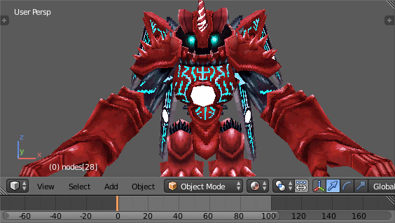

# apicula

Convert Nintendo DS models and animations to COLLADA.

The [Nitro file
formats](https://wiki.vg-resource.com/wiki/Nintendo_DS#NITRO_File_Formats) were
the formats for Nintendo's SDK for DS game developers and were used by many DS
games. This tool is for dealing with Nitro models (NSBMD files), viewing them,
and converting them to COLLADA .dae files. There is also support for loading
textures (NSBTX) and animations (NSBCA).

* [Tutorial](https://github.com/scurest/apicula/wiki/TUTORIAL)
* [Hallow's tutorial on VG Resource](https://www.vg-resource.com/thread-32332.html)
* [Common Blender issues](https://github.com/scurest/apicula/wiki/BLENDER)

## Downloads

Pre-built binaries are provided for Windows:

* [apicula-latest-x86_64-pc-windows-msvc](https://s3.amazonaws.com/apicula/apicula-latest-x86_64-pc-windows-msvc.zip) (Windows, 64-bit)
* [apicula-latest-i686-pc-windows-msvc](https://s3.amazonaws.com/apicula/apicula-latest-i686-pc-windows-msvc.zip) (Windows, 32-bit)

These are built automatically off the latest `master`. You may need one of the Visual Studio
Redistributable packages installed.

## Building

Building is done in the usual way for Rust projects. See [BUILDING.md](BUILDING.md).

## Usage

To view a set of models

    apicula view <NITRO FILES>

To convert a set of models to COLLADA, placing the generated files in the given
directory

    apicula convert <NITRO FILES> -o <OUTPUT DIR>

To extract Nitro files from a ROM or other packed file, placing extracted files
in the given directory

    apicula extract <INPUT FILE> -o <OUTPUT DIR>

To get technical information about the given Nitro files

    apicula info <NITRO FILES>

To receive help

    apicula help

See also the [tutorial](https://github.com/scurest/apicula/wiki/TUTORIAL) on the
process of extracting Nitro files from a ROM image and using apicula to convert
them to COLLADA.

## Compatibility

apicula was primarily tested with Nitro files from the following games

* Kingdom Hearts: 358/2 Days
* Ore ga Omae o Mamoru
* Rune Factory 3: A Fantasy Harvest Moon

Importing the COLLADA files we generate has been tested in the following programs:

* Blender
* Godot

If you can test in others (Maya, 3DS Max), that would be appreciated :)

## Special Thanks

* **kiwi.ds**, for models and documentation for Nitro formats. All NDS model viewers seem to be
  derived from this one. Now defunct.

* **Gericom and [MKDS Course Modifier](https://gbatemp.net/threads/mkds-course-modifier.299444/)**,
  for animation information, especially for the meaning of the basis rotations.

* **Lowlines and [Console Tool](http://llref.emutalk.net/projects/ctool/)**, for animations and
  documentation for Nitro formats. I also use Console Tool for extracting files from DS ROMs.

* **[GBATEK](http://problemkaputt.de/gbatek.htm#ds3dvideo)**, for DS hardware documentation.

* **[deSmuME](http://desmume.org/)**, for the DS debugger. `_3D_LOG_EXEC` and the GDB stub were
  invaluable.

## License

CC0
